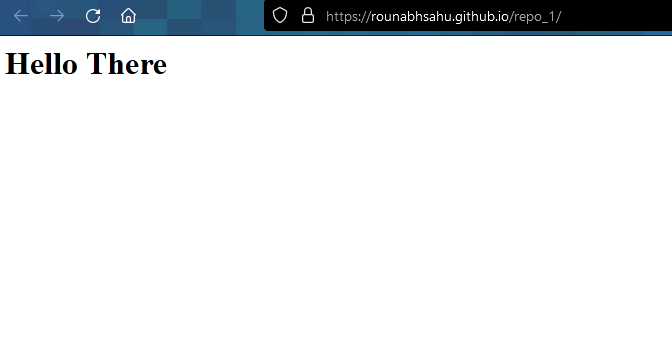

3. Deploy a static website using the same repo and add screen shot.
4. Difference between static and dynamic website.
5. Steps you followed to connect github repo to your local repo.

Answers

3.

4.
Static websites are the ones that have stable and static data which do not change where as dynamic websites pull data from backend and change accordingly.
5. 
added ssh keys and then added remote link through git commands