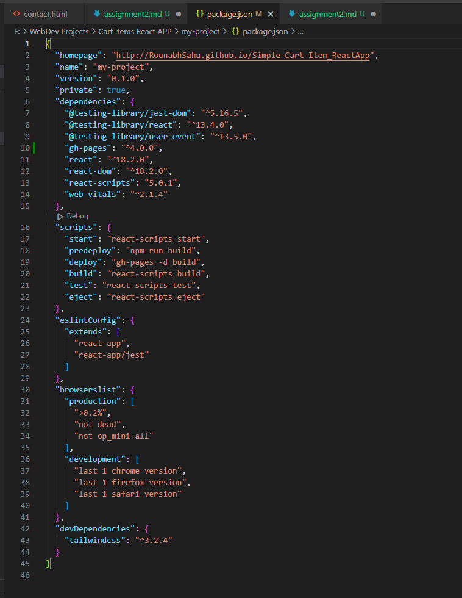
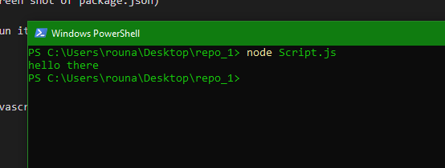

1. create a new branch in your git repo names as assignment2(paste the command)
2. tell the difference between nodejs and javascript
3. install a package using npm use it(show screen shot of package.json)
4. git command to reset a commit
5. write a simple program in javascript and run it using nodejs.

Answers.
1. git checkout -b assignment2

2. nodejs is runtime environmenrt based on javascript where as javascript is a programming language

3. 

4. git revert HEAD
5. 